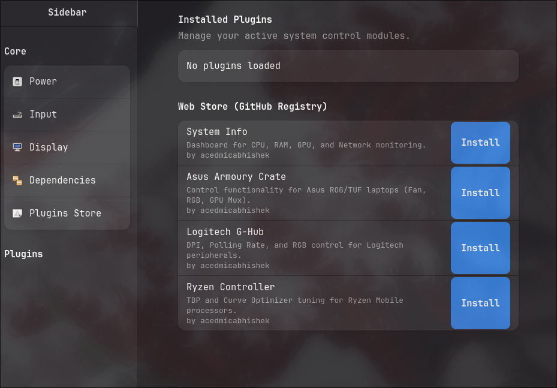
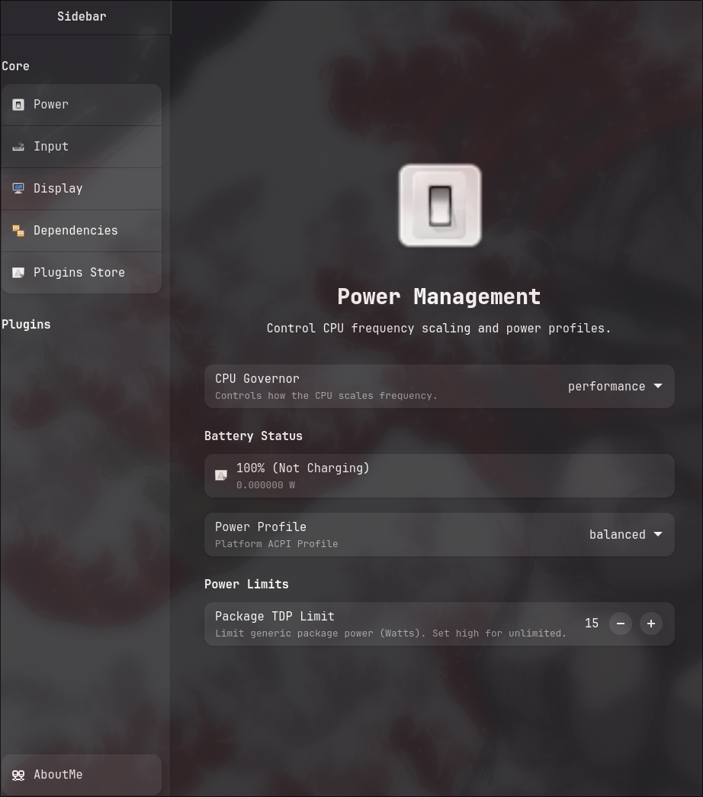
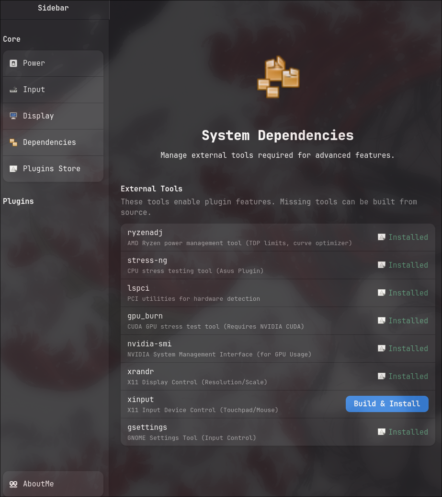

# KernelDrive

Modular Linux system control application.

<div align="center">

[](https://github.com/acedmicabhishek/KernelDrive/releases/latest)
[](https://github.com/acedmicabhishek/KernelDrive/releases)
[](https://slsa.dev)
[](https://aur.archlinux.org/packages/kerneldrive)
[](https://aur.archlinux.org/packages/kerneldrive)
[](https://github.com/acedmicabhishek/KernelDrive/stargazers)

</div>

<p align="center">
  
  <br>
  
  
</p>

# Installation 

```
yay -S kerneldrive 

```


## Core Features

KernelDrive comes with essential system control modules built-in:

-   **Power**: Manage CPU performance profiles (Platform Profile) and power policies.
-   **Input**: Configure touchpad gestures, mouse acceleration, and keyboard settings.
-   **Display**: Control screen resolution, refresh rate, and scaling (X11).
-   **Dependencies**: Built-in manager to install required external tools (`ryzenadj`, `stress-ng`, etc.).
-   **Plugin Store**: Integrated marketplace to discover and install community plugins effortlessly.

## Available Plugins

| Plugin | Description | Repository |
| :--- | :--- | :--- |
| **System Info** | Dashboard for CPU, RAM, GPU, and Network monitoring. | [Repo](https://github.com/acedmicabhishek/systemInfoPlugin.git) |
| **Asus Armoury Control** | Control functionality for Asus ROG/TUF laptops (Fan, RGB, GPU Mux). | [Repo](https://github.com/acedmicabhishek/asusArmouryCrateLinux.git) |
| **Logitech G-Hub** | DPI, Polling Rate, and RGB control for Logitech peripherals. | [Repo](https://github.com/acedmicabhishek/logitechGhubLinux.git) |
| **Ryzen Controller** | TDP and Curve Optimizer tuning for Ryzen Mobile processors. | [Repo](https://github.com/acedmicabhishek/ryzenControllerLinux.git) |


## Installation

### AUR (Arch User Repository)

You can install KernelDrive from the AUR using your favorite AUR helper (e.g., `yay` or `paru`):

```bash
yay -S kerneldrive
```

Or build manually from source:

```bash
git clone https://aur.archlinux.org/kerneldrive.git
cd kerneldrive
makepkg -si
```

## Build


```bash
meson setup build
ninja -C build
./build/kerneldrive
```

## Plugin Development Rules

Plugins must adhere to the following strict guidelines to function with KernelDrive.

### 1. Interface
Plugins must implement the `KdPlugin` interface found in `plugin_interface.h`.
You should copy `plugin_interface.h` into your plugin repository.

### 2. Entry Point
The plugin must export a C-compatible entry point named `create_plugin`.

```cpp
extern "C" {
    KdPlugin* create_plugin() {
        return new MyPlugin();
    }
}
```

### 3. Requirements
-   **Output**: Shared Object (`.so`).
-   **Toolkit**: GTK4 and Libadwaita.
-   **Slug**: `get_slug()` must return a unique string identifier (e.g., "my_plugin"). Conflicting slugs will be rejected by the loader.
-   **UI**: `create_config_widget()` must return a valid `GtkWidget*` (e.g., `AdwBin`, `GtkBox`).

### 4. Structure
The plugin is responsible for its own UI layout and logic. The host application only provides the container.

### 5. Delivery
Plugins are installed via the internal Store or by placing the `.so` file in:
`~/.local/share/kerneldrive/plugins/`


### 6. Rice / Config
for ricing you can find .ini files
`~/.config/kerneldrive/` 